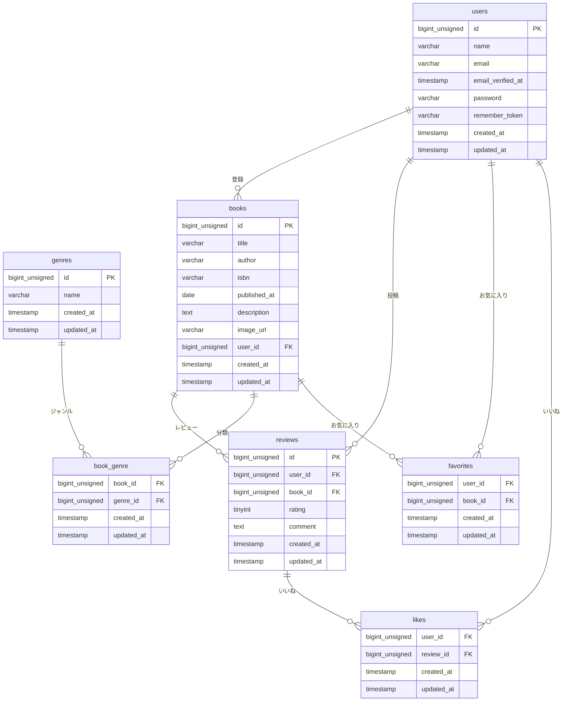

```mermaid
erDiagram
  users {
    bigint_unsigned id PK
    varchar name
    varchar email
    timestamp email_verified_at
    varchar password
    varchar remember_token
    timestamp created_at
    timestamp updated_at
  }
  genres {
    bigint_unsigned id PK
    varchar name
    timestamp created_at
    timestamp updated_at
  }
  books {
    bigint_unsigned id PK
    varchar title
    varchar author
    varchar isbn
    date published_at
    text description
    varchar image_url
    bigint_unsigned user_id FK
    timestamp created_at
    timestamp updated_at
  }
  reviews {
    bigint_unsigned id PK
    bigint_unsigned user_id FK
    bigint_unsigned book_id FK
    tinyint rating
    text comment
    timestamp created_at
    timestamp updated_at
  }
  book_genre {
    bigint_unsigned book_id FK
    bigint_unsigned genre_id FK
    timestamp created_at
    timestamp updated_at
  }
  favorites {
    bigint_unsigned user_id FK
    bigint_unsigned book_id FK
    timestamp created_at
    timestamp updated_at
  }
  likes {
    bigint_unsigned user_id FK
    bigint_unsigned review_id FK
    timestamp created_at
    timestamp updated_at
  }

  users ||--o{ books : "登録"
  users ||--o{ reviews : "投稿"
  users ||--o{ favorites : "お気に入り"
  users ||--o{ likes : "いいね"
  books ||--o{ reviews : "レビュー"
  books ||--o{ book_genre : "分類"
  books ||--o{ favorites : "お気に入り"
  genres ||--o{ book_genre : "ジャンル"
  reviews ||--o{ likes : "いいね"
```