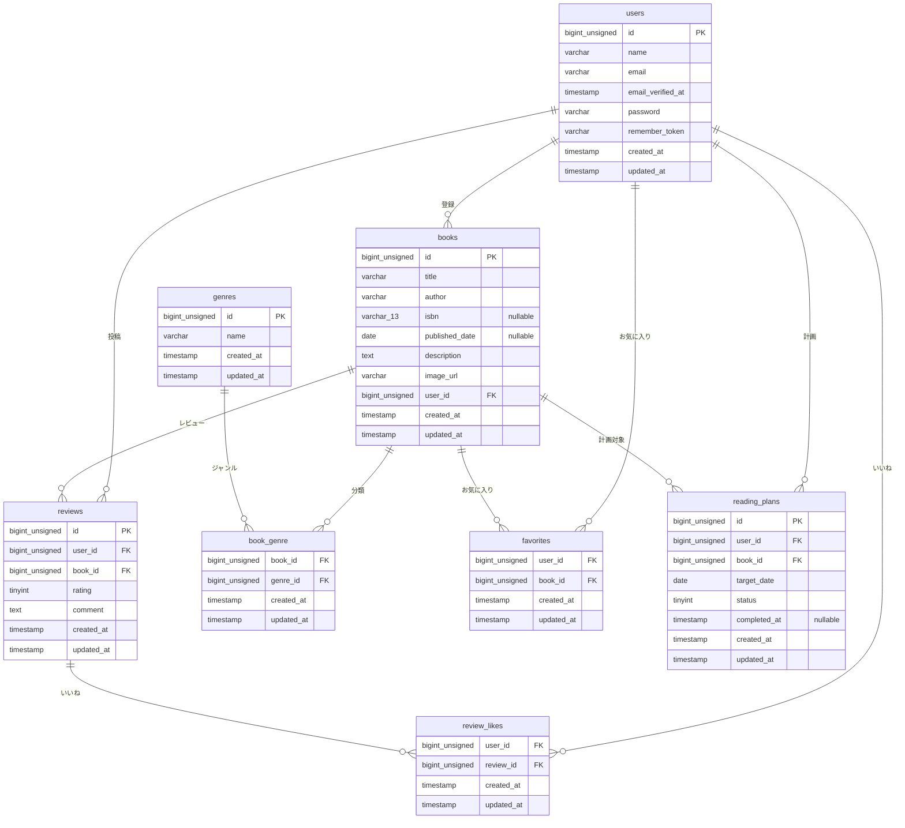

# BookShelf 書籍レビューアプリ

書籍の登録・レビュー投稿・お気に入り管理ができる書籍レビューアプリです。
ジャンル管理・いいね機能・ランキング表示に加え、ISBN検索・マイ読書レポート・読書計画・リマインダー通知・Sanctum認証など、実務で必要な応用的な機能を幅広く実装しています。

## 作成者

山口 琴音

## 使用技術

- PHP 8.5
- Laravel 10.x
- MySQL 8.4
- Docker / Laravel Sail
- Node.js（Vite / npm）
- Tailwind CSS 3.4.0
- Laravel Sanctum（APIトークン認証）
- Google Books API（ISBN検索、外部連携）
- Laravel Notification facade（DatabaseChannel）
- Laravel Task Scheduling（日次バッチ処理）

## ER図



※ `notifications` テーブルは Laravel 標準のポリモーフィック通知機能（`notifiable_type` / `notifiable_id`）のため、本図からは除外しています。

### テーブル設計の補足

- `reviews` テーブルには `user_id`・`book_id` の複合UNIQUE制約があり、1ユーザーが同じ書籍に投稿できるレビューは1件までです。
- `reading_plans` テーブルにも `user_id`・`book_id` の複合UNIQUE制約があり、1ユーザーが同じ書籍に持てる読書計画は1件までです。
- `books` テーブルの `isbn`・`published_date` は応用機能でnullable（任意入力）に変更されています。
- 中間テーブル（`book_genre`・`favorites`・`review_likes`）はいずれも複合主キー構成で、同じ組み合わせのレコードが重複登録されないようになっています。
- 外部キーには `ON DELETE CASCADE` を設定しており、親レコードの削除時に関連データも自動的に削除されます。
- `reading_plans.status` は `App\Enums\ReadingPlanStatus`（`InProgress` / `Completed` / `Overdue`）とEloquentの `casts()` で紐付けられています。

## 開発環境URL

http://localhost

## 動作環境

- Docker Desktop
- Laravel Sail
- MySQL 8.4
- Node.js / npm
- Vite

## 環境構築手順

1. **リポジトリをクローン**

    ```bash
    git clone https://github.com/osakana-works/bookshelf-review-app.git
    cd bookshelf-review-app
    ```

2. **.envファイルの準備**

    `.env.example` をコピーして `.env` を作成し、DB接続情報を環境に合わせて設定。

    ```bash
    cp .env.example .env
    ```

3. **Google Books APIキーの設定（ISBN検索機能で使用）**

    ISBN検索機能はGoogle Books APIを利用しますが、APIキーなしではリクエスト上限がほぼ0のため、必ずAPIキーを取得して設定してください。

    1. [Google Cloud Console](https://console.cloud.google.com/) にアクセスし、プロジェクトを作成（または既存のものを選択）
    2. 「APIとサービス」→「ライブラリ」から「Books API」を検索して有効化
    3. 「認証情報」→「認証情報を作成」→「APIキー」を選択し、キーを発行
    4. `.env` の以下の項目に、発行したAPIキーを設定

        ```dotenv
        GOOGLE_BOOKS_API_KEY=取得したAPIキーをここに貼り付け
        ```

4. **Composer依存パッケージのインストール**

    ```bash
    composer install
    ```

5. **Laravel Sailの起動**

    ```bash
    ./vendor/bin/sail up -d
    ```

6. **アプリケーションキーの生成**

    ```bash
    ./vendor/bin/sail artisan key:generate
    ```

7. **データベースのマイグレーションと初期データ投入**

    ```bash
    ./vendor/bin/sail artisan migrate --seed
    ```

    シーダーには、読書計画・リマインダー通知の各種挙動（進行中／期限切れ／読了済み、3日前・当日・3日後通知、重複送信防止の確認用データなど）を採点時に確認できるダミーデータが含まれています。動作確認は主に `yamada@example.com`（パスワード: `password`）で行ってください。

8. **フロントエンドのビルド**

    ```bash
    sail npm install
    sail npm run dev
    ```

9. **アプリケーションへのアクセス**

    http://localhost

## 日次バッチ処理について

読書計画のステータス自動更新（期日超過 → 期限切れ）と、リマインダー通知（期日の3日前・当日・3日後）の送信は、Laravelのタスクスケジューラで実行されます。

### 開発環境（Sail）で動作確認する場合

以下のコマンドでスケジューラーを起動してください（起動している間、1分ごとにスケジュールがチェックされます）。

```bash
sail artisan schedule:work
```

即座に動作確認したい場合は、コマンドを直接実行することもできます。

```bash
sail artisan reading-plans:update-statuses
```

### 本番環境の場合

サーバーのcrontabに、以下の1行を登録してください。

```
* * * * * cd /path-to-your-project && php artisan schedule:run >> /dev/null 2>&1
```

これにより、1分ごとに `php artisan schedule:run` が実行され、`app/Console/Kernel.php` に登録されたスケジュール（毎日0時に読書計画のステータス更新・通知送信を実行）が処理されます。

## テスト実行

```bash
./vendor/bin/sail artisan test
```

```bash
# テストカバレッジの確認
./vendor/bin/sail artisan test --coverage
```

現在のテストカバレッジ: 92.1%（213件のテスト、481アサーション）

## 機能一覧

### 基本機能

- 会員登録・ログイン・ログアウト（Laravel Fortify、日本語化対応）
- 書籍登録・編集・削除（作成者本人のみ編集・削除可能）
- 書籍一覧・詳細表示（ページネーション）
- ジャンル管理（登録・編集・削除、書籍紐付きがある場合は削除制限）
- レビュー投稿・編集・削除（投稿者本人のみ編集・削除可能、1ユーザー1書籍につき1件まで）
- お気に入り登録・解除（トグル形式）
- いいね機能（トグル形式）
- ランキング表示（平均評価TOP10）
- 公開API（書籍CRUD）

### 応用機能

- 書籍一覧の検索・フィルタ・ソート（キーワード検索、ジャンル絞り込み、並び順、検索条件を維持したページネーション）
- ISBN検索（Google Books APIと連携し、書籍情報をフォームに自動入力）
- マイ読書レポート（総レビュー数・読了冊数・平均評価、評価分布、高評価書籍TOP5、ジャンル別評価傾向TOP5）
- 読書計画機能（作成・編集・削除・状態絞り込み・読了操作、所有者のみ操作可能）
- リマインダー通知（読書計画の期日3日前・当日・3日後に自動送信、既読管理）
- 日次バッチ処理（期日超過の読書計画を自動的に「期限切れ」へ変更）
- 公開APIのSanctumトークン認証（書き込み系エンドポイントに認証・認可を導入）

## APIエンドポイント一覧

### 認証

| HTTPメソッド | URI | 概要 | 認証 |
|---|---|---|---|
| POST | /api/v1/login | ログインしてAPIトークンを発行 | 不要 |
| POST | /api/v1/logout | ログアウトしてAPIトークンを無効化 | 必須 |

### 書籍

| HTTPメソッド | URI | 概要 | 認証 |
|---|---|---|---|
| GET | /api/v1/books | 書籍一覧取得（ページネーション対応） | 不要 |
| GET | /api/v1/books/{id} | 書籍詳細取得 | 不要 |
| POST | /api/v1/books | 書籍登録 | 必須 |
| PUT | /api/v1/books/{id} | 書籍更新（所有者のみ） | 必須 |
| DELETE | /api/v1/books/{id} | 書籍削除（所有者のみ） | 必須 |

認証にはBearerトークン（`Authorization: Bearer {token}`ヘッダ）を使用します。未認証時は401、他ユーザーの書籍への書き込みは403を返します。
