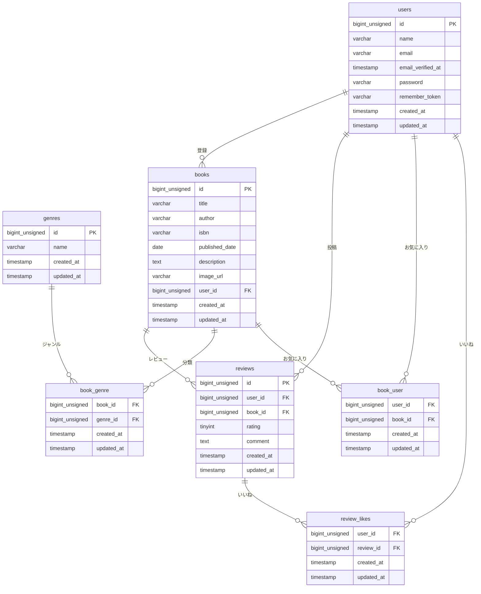

# BookShelf 書籍レビューアプリ

書籍の登録・レビュー投稿・お気に入り管理ができる書籍レビューアプリです。
ジャンル管理・いいね機能・ランキング表示・公開APIなど、実務で必要な機能を幅広く実装しています。

## 作成者

山口 琴音

## 使用技術

- PHP 8.5
- Laravel 10.x
- MySQL 8.4
- Docker / Laravel Sail
- Node.js（Vite / npm）
- Tailwind CSS 3.4.0

## ER図



## 開発環境URL

http://localhost

## 動作環境

- Docker Desktop
- Laravel Sail
- MySQL 8.4
- Node.js / npm
- Vite

## 環境構築手順

1. **リポジトリをクローン**

```bash
    git clone https://github.com/osakana-works/bookshelf-review-app.git
    cd bookshelf-review-app
```

2. **.envファイルの準備**

    `.env.example` をコピーして `.env` を作成し、DB接続情報を環境に合わせて設定。

```bash
    cp .env.example .env
```

3. **Composer依存パッケージのインストール**

```bash
    composer install
```

4. **Laravel Sailの起動**

```bash
    ./vendor/bin/sail up -d
```

5. **アプリケーションキーの生成**

```bash
    ./vendor/bin/sail artisan key:generate
```

6. **データベースのマイグレーションと初期データ投入**

```bash
    ./vendor/bin/sail artisan migrate --seed
```

7. **フロントエンドのビルド**

```bash
    sail npm install
    sail npm run dev
```

8. **アプリケーションへのアクセス**

    http://localhost

## テスト実行

```bash
./vendor/bin/sail artisan test
```

## 機能一覧

- 会員登録・ログイン・ログアウト（Laravel Fortify）
- 書籍登録・編集・削除
- 書籍一覧・詳細表示（ページネーション）
- ジャンル管理（登録・編集・削除）
- レビュー投稿・編集・削除
- お気に入り登録・解除
- いいね機能
- ランキング表示（平均評価TOP10）
- 公開API（書籍CRUD）

## APIエンドポイント一覧

| HTTPメソッド | URI | 概要 |
|---|---|---|
| GET | /api/v1/books | 書籍一覧取得（ページネーション対応） |
| GET | /api/v1/books/{id} | 書籍詳細取得 |
| POST | /api/v1/books | 書籍登録 |
| PUT | /api/v1/books/{id} | 書籍更新 |
| DELETE | /api/v1/books/{id} | 書籍削除 |